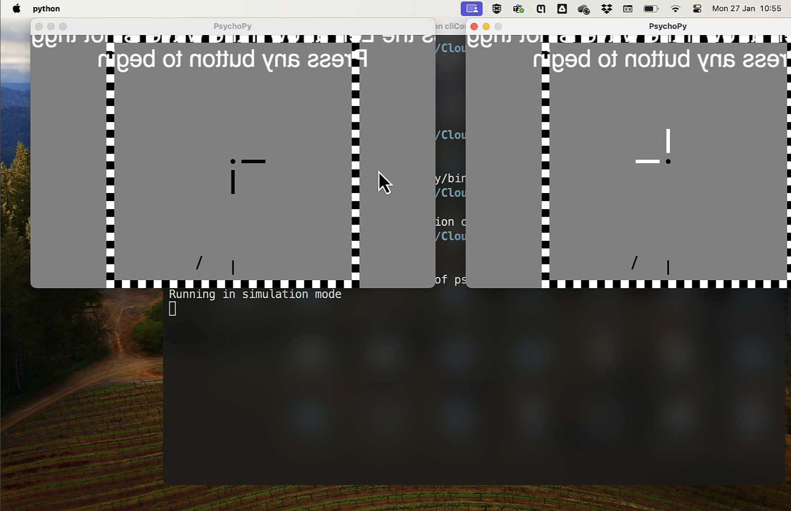

# Testing folder 

ds, 2025-01 started

We want to add certain things to the workflow that will make collecting, sharing, and analyzing data easier.

1. psychophysics code needs to be runnable on machines other than in the stereo lab
2. psychophysics data needs to be easily parsable (tidy format!) and for now, stored in CSV format and also checked into the repo. TODO: make sure that it contains all we need
3. version of code that are being run in the lab need to be **tagged**, so we know what version of the code was run for a given dataset.

For 1, we can use `conda env` to run with a pinned version of python and all dependencies. This will make it easier to run the code on other machines. in particular, ``python``, ``psychopy`` and other stuff needs to match

On macos / linux, the following should work (WSL? on Window, too?)

```bash
conda env create -n psychopy 
conda activate psychopy
#... some dependencies, version!, etc.
```

The version installed in the labs is as old as the hills (1.70.00) >10,15 years old... so will not run indefinitely, but I managed to get it to run on my machine with some checks and pointing at code that's moved (eg `PatchStim()` -> `GratingStim()`)

